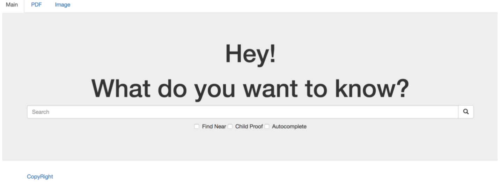
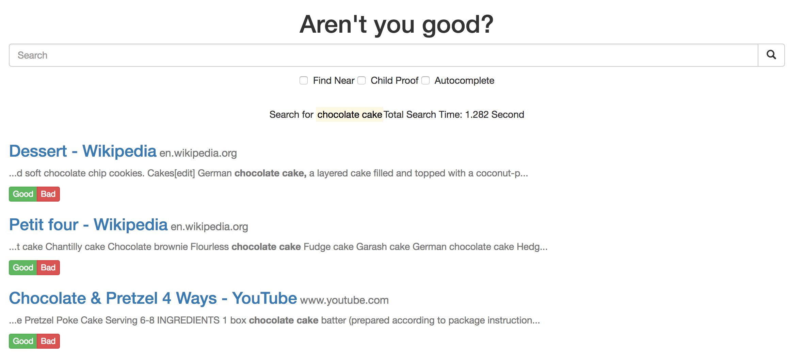

* CIS555 Final Project 
* Author 
* Yu-Ho Hsieh (Crawler, Search Engine)
* Lanqing Yang (Indexer)
* Paul Hsu (Page Rank)
* sam weinberg


# Mini-Google Search Engine

We develop a Mini-Google Search Engine from scratch, including crawling pages, indexing pages, identifying page ranking and integrating all information to display on search engine interface.


## Getting Started

This project may not be able to run on your machine due to some aws credential issue and environment. However, if you dive into the code and using 
```
mvn clean install
```
```
mvn compile
```
You should be able to install all the basic required components to run the code such as Jetty, aws dependecy, Hadoop, S3 connection, NLP packages.  

### Prerequisites

Please refer to pom.xml in each folder.


### Key Feature
* Implement master-client design for crawler to increase scalability and fault tolerance incase of the crash of workers.
* Implement batch process for crawling, storing, and searching to reduce IO read write, notwork bandwith usage, and to increase searching and loading efficiency.
* Implment LRU cache machenism to reduce same-popular-url crawling, same-popular-document downloading
* Extra features such as childproof, user-location searching, auto-complete, and support image and pdf search
* Not very sure for the key features in indexer and pagerank 

### Key Chanllenge
* Utlizing AWS Hadoop, EMR, due to their terrible documentation
* Suffer from crawling at first due to removing redirect urls 
* Hardware problem such as Java Heap not enough, storage speed is too slow


## Some snap shots



## Built With

* [Jetty](https://www.eclipse.org/jetty/) - The host server service
* [Maven](https://maven.apache.org/) - Dependency Management
* [AWS](https://aws.amazon.com/) - Storage, computing, database, and deployment


## Authors

* **Yu-Ho Hsieh** - Crawler, Search Engine (https://www.linkedin.com/in/yu-ho-hsieh-059316b8/)
* **Lanqing Yang** - Indexer (https://www.linkedin.com/in/lanqing-yang/)
* **Tse-Lun (Paul) Hsu** - Page Rank (https://www.linkedin.com/in/tse-lun-paul-hsu-13652998/)
* **Samuel Weinberg** - Search Engine (https://www.linkedin.com/in/samuel-weinberg-8a126ab3/)


## Acknowledgments

* Standford NLP
* WolfGarbe Spell Check
